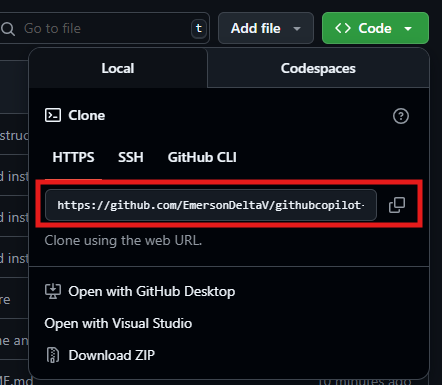
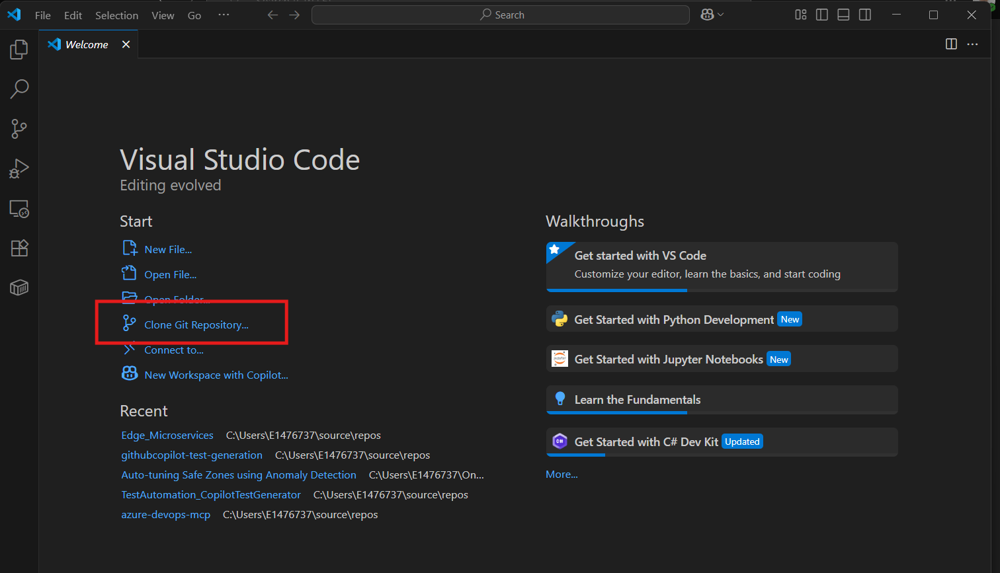
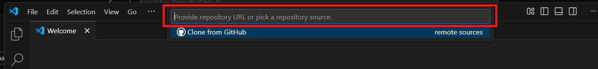
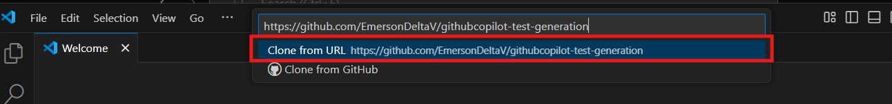
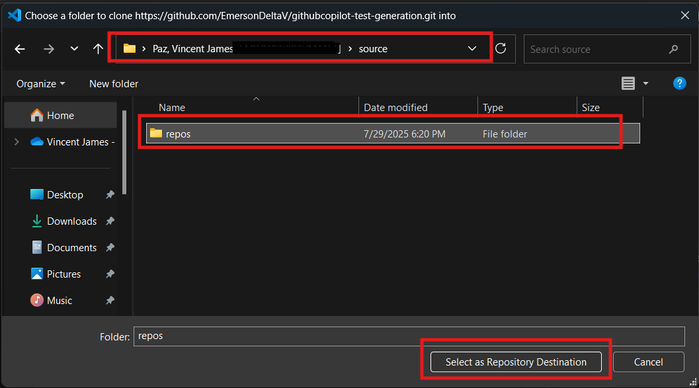
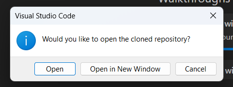
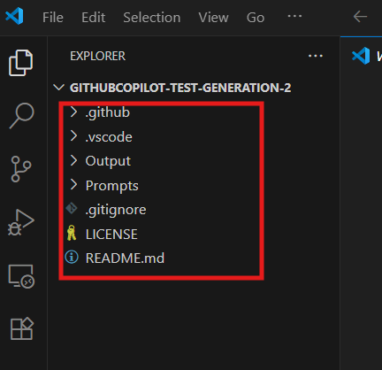
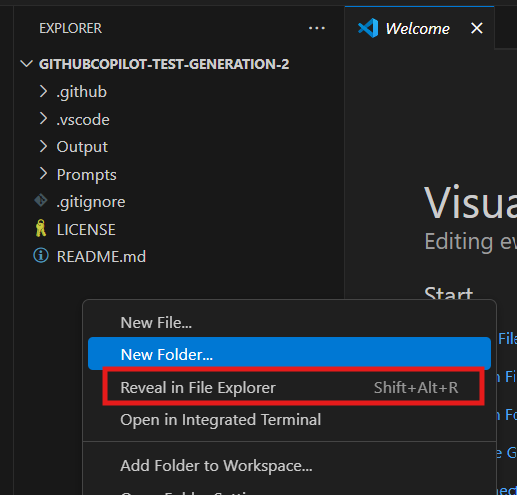
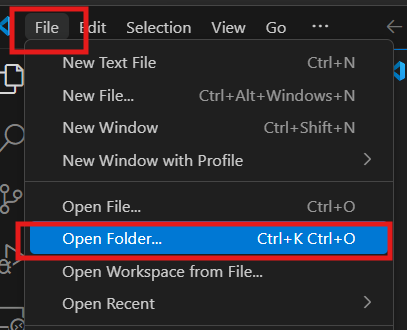

# Introduction

This document explains how to clone a repo

1. Copy the url of the GitHub Repository you would like to clone.

2. Navigate to VS Code and click on the `Clone Git Repository...` link.

3. Paste the Github Url in the search bar.

4. Click the `Clone from URL`.

5. Select the destination folder you'd like to use, Ussually under `[UserProfile] > source > repos` folder. 

6. Wait until the Open Repo dialog appears, then click open.

7. You should be able to navigate through your files if successful.

# Others

8. If you want to know where the repository is located at, right click the Explorer side bar then click on `Reveal in File Explorer`. 

9. You can reopen your local repo anytime as needed, no need to clone the repo again.

10. Just open the local repo folder again from `File` menu.

# References

If you want to learn more about how you can work with Git repositories. Read this [article](https://code.visualstudio.com/docs/sourcecontrol/intro-to-git).
